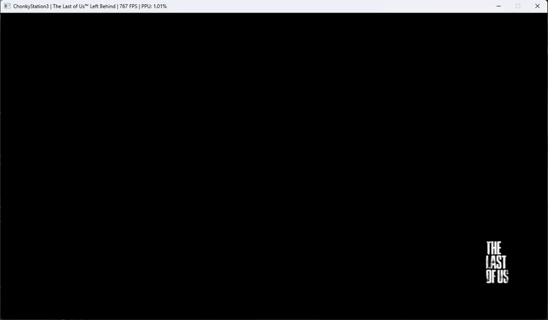

<h1>
  

    <strong>A PlayStation© 3 emulator</strong>
  

</h1>

---

ChonkyStation3 is a work-in-progress emulator for the PlayStation 3 system. 
It can currently boot a few simple commercial games. 
This is a hobby project I'm developing for fun and to learn. 
<b>You should not use this to actually play games.</b> At least not for now. 

---
 

    <a href="https://discord.gg/YU2yjP5jvS"></img></a>

---
 

    <h1>Showcase</h1>
    
    

---
 

  <h1>Download</h1>

<table align="center">
  <tr>
    <td><b>Windows SDL</td>
    <td></td>
    <td><a href="https://nightly.link/liuk7071/ChonkyStation3/workflows/windows/master/ChonkyStation3.zip">Download</td>
  </tr>
  <tr>
    <td><b>Linux SDL</td>
    <td></td>
    <td><a href="https://nightly.link/liuk7071/ChonkyStation3/workflows/linux/master/ChonkyStation3.zip">Download</td>
  </tr>
  <tr>
    <td><b>MacOS SDL</td>
    <td></td>
    <td><a href="https://nightly.link/liuk7071/ChonkyStation3/workflows/macos/master/ChonkyStation3.zip">Download</td>
  </tr>
</table>

 

<table align="center">
  <tr>
    <td><b>Windows Qt</td>
    <td></td>
    <td><a href="https://nightly.link/liuk7071/ChonkyStation3/workflows/qt/master/Windows%20executable%20Qt6.zip">Download</td>
  </tr>
</table>

<small>Qt builds for Linux and MacOS will be available soon.</small>

---
 

  <h1>Usage</h1>

  

    Run the emulator once. It will create a "Filesystem" folder next to the executable (in the future the path will be configurable). 
    This folder contains all the virtual devices of the emulated PS3. The ones you'll be looking at are dev_flash and dev_hdd0. 
  

  <h2>Installing a game</h2>
  
  <h3>Step 1: unpack the .pkg file</h3>
  

    ChonkyStation3 currently lacks a native way to install game packages (.pkg).
    You will need to use third party tools to unpack them. 
    The easiest way to do it is through RPCS3. Install the game in the emulator, then copy over the game contents located in dev_hdd0/game/[TITLE ID] to the same folder in ChonkyStation3's filesystem. The title ID is next to the game's name in RPCS3's game list. Alternatively, if you don't want to keep 2 copies of the game, you could create a symlink to point ChonkyStation3's dev_hdd0 folder to RPCS3's. 
  

  <h3>Step 2: decrypt the game executable</h3>
  

    By this point, if you open ChonkyStation3, you should be able to see the game in the game list. However, attempting to launch it will give you an error complaining about a missing "EBOOT.elf" file. This happens because PS3 game executables are encrypted, and ChonkyStation3 currently can't decrypt games on its own. You'll need to use a third party tool again. As it was for step 1, you can easily do this through RPCS3. 
    Open RPCS3, navigate to "Utilities > Decrypt PS3 binaries". Select the file "EBOOT.BIN" located under the "USRDIR" folder in the game contents. You can find the path of the game contents folder by right clicking it and pressing "Open Folder > Open HDD Game Folder". 
  

  <h3>Step 3: decrypt other game files</h3>
  

    Some games (a lot of them) contain *.edat files in their content folder. You need to manually decrypt these files just like you did with the game executable - however, you need to make sure the decrypted files have the same name as the encrypted ones (ending in ".edat"). Just rename the old encrypted file to something else instead of deleting it entirely, so you have a backup in case things break.
  

  <h2>Intalling the PS3 system software</h2>

  

    Installing the PlayStation 3 system software is required for games to work. 
    You can follow RPCS3's quickstart guide to install it in their emulator. You should then decrypt (using the same method as step 2 and 3 in "Installing a game") the required .sprx files located inside dev_flash/sys/external and copy over the entire dev_flash folder to ChonkyStation3's filesystem. Make sure you copy the whole folder and not just the decrypted .prx files, because the folder contains other necessary system files. 
    This is the list of the required PRX files as of the latest commit: 
    <ul>
      <li>liblv2.prx</li>
      <li>libsre.prx</li>
      <li>libspurs_jq.prx</li>
      <li>libkey2char.prx</li>
      <li>libl10n.prx</li>
      <li>libfiber.prx</li>
      <li>libresc.prx</li>
    </ul>
    The list is likely to get updated frequently.
  

---
 

  <h1>Building</h1>

  

    Building ChonkyStation3 under any of the supported platforms should be as simple as building any cmake project. 
    <pre><code>
      # Clone the repository recursively
      git clone https://github.com/liuk7071/ChonkyStation3.git --recursive 
      # Create build directory
      cd ChonkyStation3
      mkdir build && cd build 
      # Setup cmake project
      cmake .. -DCMAKE_BUILD_TYPE=Release -G"[Type your preferred generator here]" 
      [Invoke make or Visual Studio or whatever you chose]
  </code></pre> 
  
  You can optionally specify 2 cmake flags:
  <ul>
    <li><b>-DENABLE_USER_BUILD=ON</b>: Enables a user build. This suppresses most logs and disables some debugging options.</li>
    <li><b>-DENABLE_QT_BUILD=ON</b>: Enables a Qt6 build. This requires you to install Qt6 as a dependency.</li>
  </ul>
  

---
 

  <h1>Acknowledgements</h1>

  <ul>
    <li>
    <a href="https://github.com/RPCS3/rpcs3"><b>RPCS3</b></a>: None of this would have been possible without the extensive research done by the RPCS3 team over the past decade. A lot of information I couldn't gather through my own testing comes from their work.
    </li>
    <li>
    <a href="https://github.com/ps3dev/PSL1GHT"><b>PSL1GHT</b></a>: An open source PS3 SDK. It has been very useful to learn how parts of CellOS work and to write my own tests.
    </li>
    <li>
    <a href="https://www.psdevwiki.com/ps3/"><b>psdevwiki</b></a>: A useful website containing a lot of misc information about the PS3, as well as other PlayStation consoles.
    </li>
  </ul>

---
 

  <h1>Related Projects</h1>

  <ul>
    <li>
    <a href="https://github.com/wheremyfoodat/Panda3DS"><b>Panda3DS</b></a>: An HLE Nintendo 3DS emulator for Windows, Linux, MacOS and Android by <a href="https://github.com/wheremyfoodat">wheremyfoodat</a> (aka Peach).
    </li>
    <li>
    <a href="https://github.com/OFFTKP/felix86"><b>felix86</b></a>: A new x86-64 → RISC-V Linux userspace emulator.
    </li>
  </ul>

